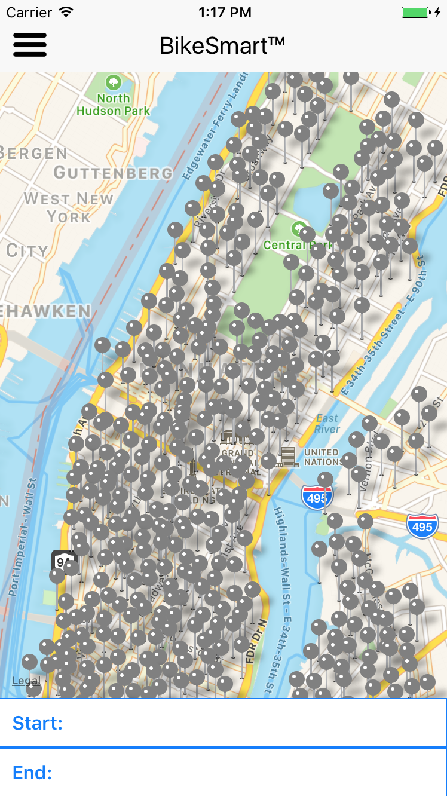
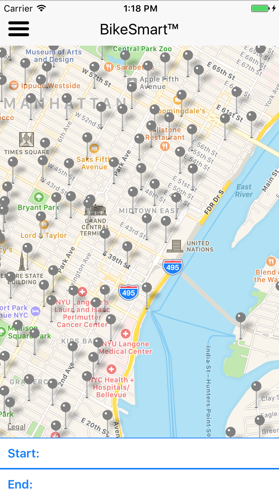
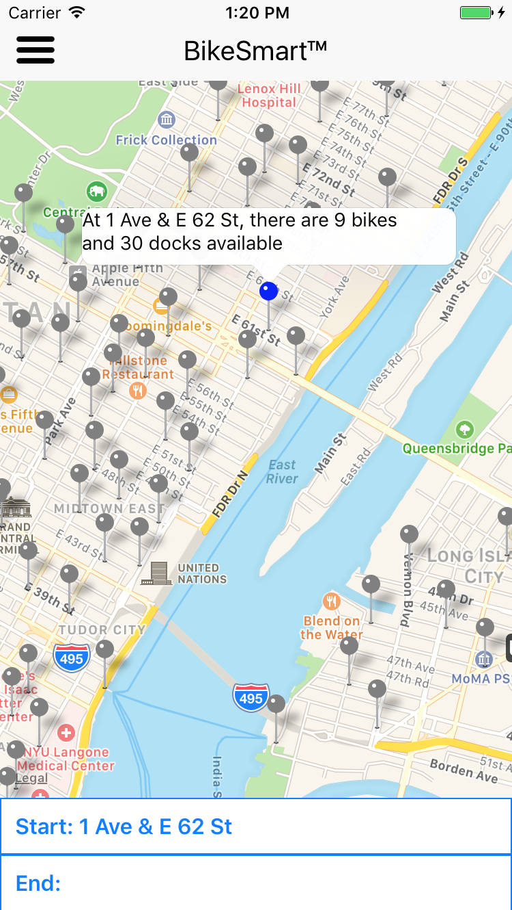
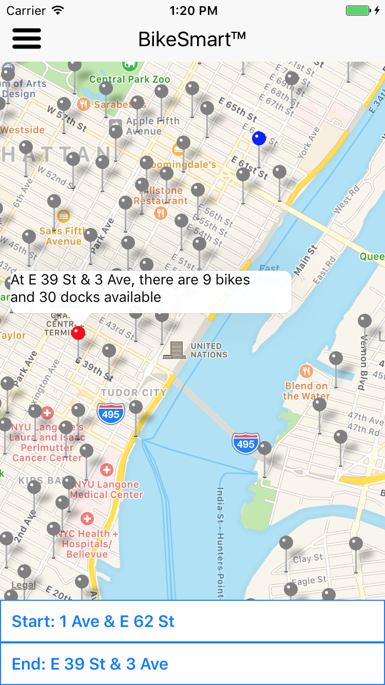

## Bike-Smart

An iOS-exclusive application built in React Native that makes your Citi-bike experience that 
much better. Bike-Smart seeks to replicate the existing functionality of
existing Citi-bike apps through a familiar interface, where users can click on 
any of the displayed Citi-bike stations in New York City and get live information.

After selecting and locking in their starting station and destination, 
users can then **predict** based on last week's data when to best plan their trip.
If they live near Union Square and the station at 12th St. and 3rd Ave normally empties
out around 8:30 AM, Bike-Smart allows them access this information ahead of time.

## Features

### Replicating the official Citi-bike application

#### Home Page

 
 

 Every Citi-bike station is displayed via markers on Apple Maps. 

 
 
 

 

<!---->

